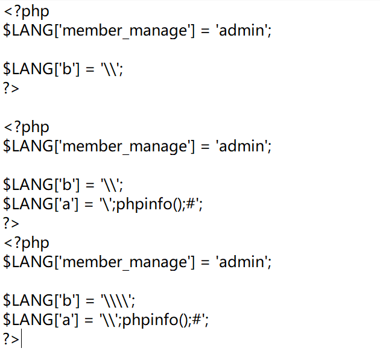

# web
## easy_php

源码审计：

这里发现可以修改 config.php 文件，并且还可以访问的到，所以我们就想到利用 php代码拼接注入恶意代码，但是这里有函数 addslashes() 函数限制了注入，我们需要想办法绕过。

addslashes(string $str): string
返回字符串，该字符串为了数据库查询语句等的需要在某些字符前加上了反斜线。这些字符是单引号（'）、双引号（"）、反斜线（\）与 NUL（null 字符）。

可以在本地测试，观察 config.php 文件的修改，

这里出现的漏洞点是第 27 行的 $content = str_replace($LANG[$key],$_POST['no1'],$content);

通过测试发现了以下的绕过方法。

post:
sudo=1&info[name]=b&no1=\
sudo=1&info[name]=a&no1=';phpinfo();#
sudo=1&info[name]=b&no1=\
config.php 变化如下：

这样就成功逃逸执行了 phpinfo()，然后只需要将';phpinfo();#替换为';eval($_POST[a]);#即可 getshell 了

## zblog-scshop

是个 CMS，尝试了下 web.zip，发现存在源码泄露，是 Scshop1.5，通过网上查找，可以发现在 /Core/Program/Ant_Contrl.php 可能存在 sql注入

在这个 GetIp() 函数中，没有进行严格的过滤发现 ip 可控并且没有过滤，查看哪里调用了这个函数

我们随便找一个，去 Ant_Fc.php 里边看一下

这里的 $val 进行了拼接，直觉告诉我这很有可能是利用点，接着看一下 AntAdd() 函数，类 WD_Data_Process() 是在 Ant_Class.php 中定义的，查看该文件

我们发现将刚才的值直接加入了 sql 语句进行执行，我们可以构造如下 payload 进行验证

INSERT INTO  $table ($field) VALUES ('1','2',''or sleep(3) or '','3','4');

我们通过搜索 Search_Data 来查找哪里调用了这个函数，发现在 /Template/Default/File/search.php

需要使得 $_POST['search']=1

接下来就可以只需要编写脚本进行盲注,有些wp也说sqlmap能跑，还有说评论区有账户密码，没怎么注意。

账号密码为：WHTadmin/admin888

然后通过主题文件的上传进行 getshell

下载主题，然后在 vscode 中打开.zba 文件，我这里找的是 comment.php

< path>HTML5CSS3/template/comment.php< /path>< stream>base64编码内容< /stream>
将编码改为一句话木马的 base64 编码，然后再将主题上传上去，然后访问 /zblog/zb_users/theme/[主题名]/template/comment.php

成功 getshell 后就可以获取 flag 了

# 密码学
## do_you_know_it

在线网站http://detexify.kirelabs.org/classify.html

取首写字母拼成flag

## 签到

56465a7757464977546d464e656b354b5632786b5346457862336c4f4d4842485632785a4d6c5a47556c46554d557057556a464e656c5a466146465756444135554651774f5642525054303d

16进制转文本

base64两次

base32一次

得到flag{Flag_Is_Nothing}

# 总结

比赛难度较高，还是太菜做不出来，也有请教一些大师傅才完成的这些题。
这次的附件题存一手日后再战，有完成其他题目的大佬也可以一起交流。